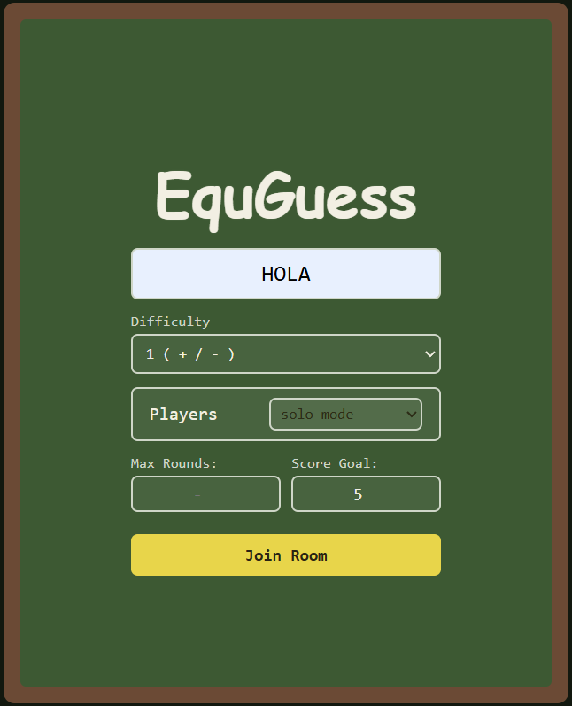
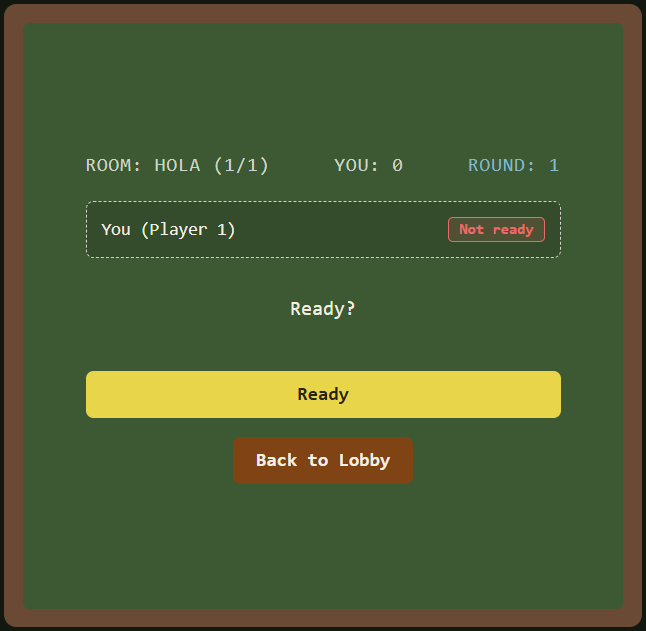
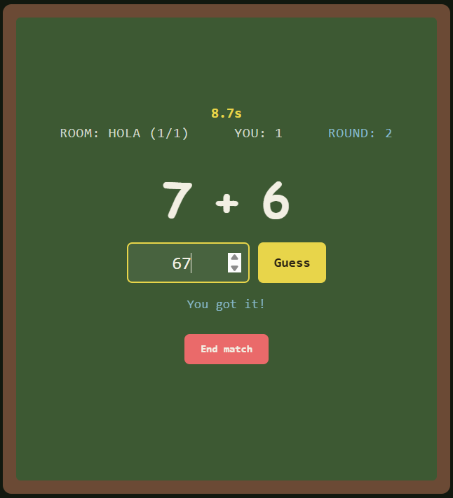
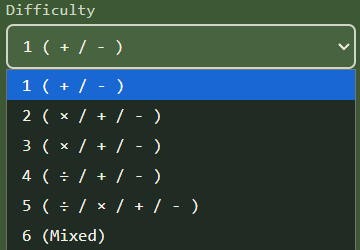
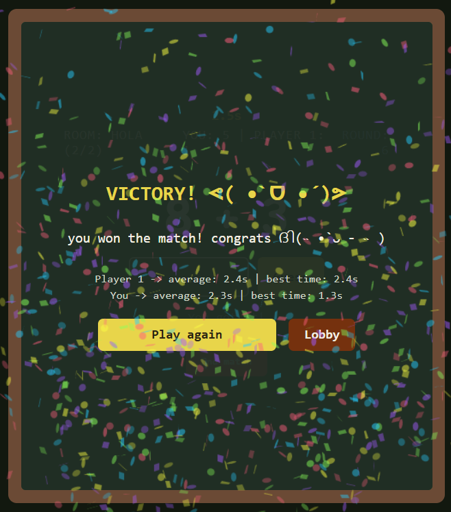
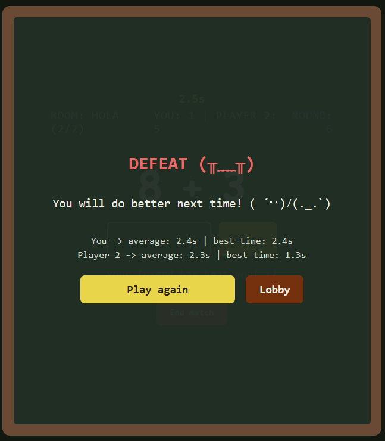

# EquGuess
a race game (made with HTML, CSS and JavaScript) to play with up to 4 friends or in solo mode, if you prefer it that way. The idea is simple, do the math before the rest to win, your time for each equation will be counted and you can see your stats in the end!

## Lobby & Waiting room
When entering the game, you'll see a lobby in which you can select the amount of players, difficulty, room name, rounds and score goal

## Game display

### Max rounds / Score goal
When a player gets to the score goal, the game ends, even if the rounds are not finished, if the rounds are finished before the goal is reached, the match ends aswell

### Room name
You can choose a room name, if that room already exists, you'll enter said room, otherwise, you'll be creating a new room with the configuration you selected.

If the room already exists and it is full, you'll get a message saying so, and you won't be able to join.

### Difficulty / Levels
You have levels from 1 to 6, going from simple equations ("+" & "-") to more complex ones, (mixed, with "÷" & "×" )

### Exit
You have a few ways to go back to the lobby and waiting room:
- "Lobby" / "Play again" buttons: found when the match ends
- "Back to lobby" button: found at the waiting room
- "End match" button: found during the game, it takes you to the lobby

## Game Over
When winning, you get fun confetti and a victory message right above your (and your friends') average time and best time (stats).
 
When losing, no confetti :/, and a defeat message above your and your friends' stats

     
    

